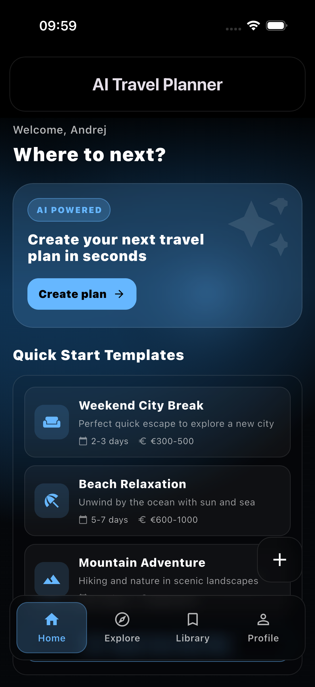
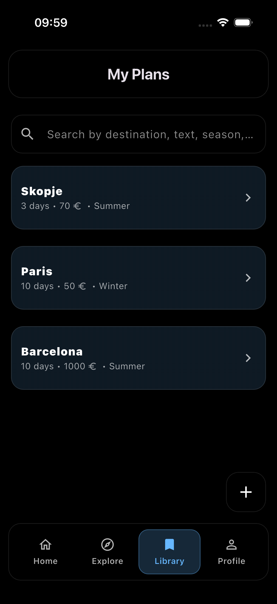
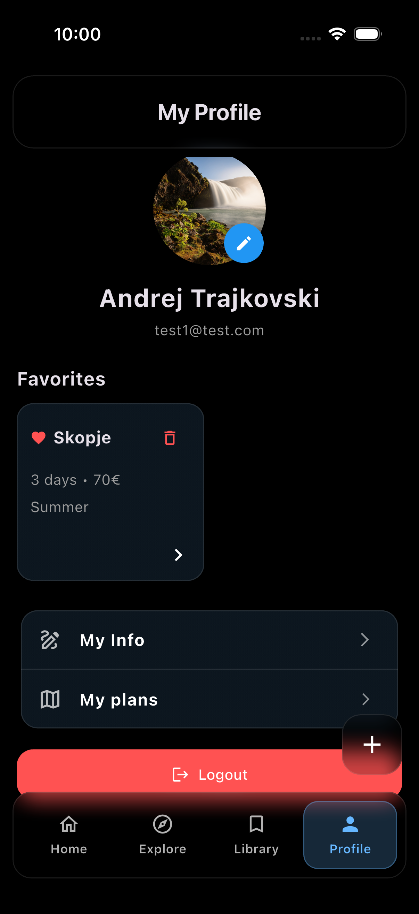
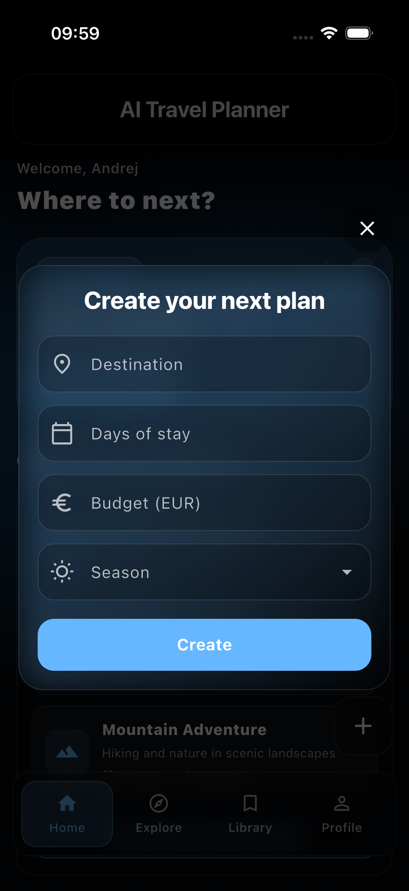
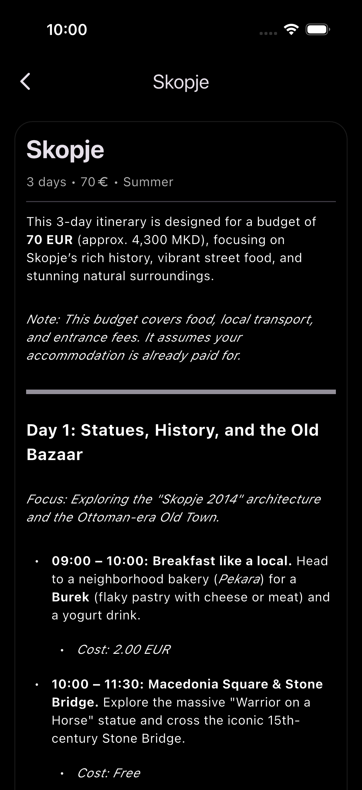

# AI Travel Planner ✈️🤖

Flutter апликација за генерирање персонализирани Travel Itinerary планови со **Gemini 3 Flash**, со Firebase автентикација и складирање на податоци во Firestore Database.

## ✨ Карактеристики

### 🏠 Home екран
- **Интерактивен почетен екран** со поздрав и краток преглед, генериран за секој корисник посебно.
- **AI генерирање план** – корисникот внесува дестинација, денови на престој, буџет (EUR) и сезона, а апликацијата креира детален дневен план.
- **Quick start темплејти** – подготвени предлози (city break, beach, mountain и др.) за побрз старт.

### 🌍 Explore екран
- **Глобални планови** зачувани во **Firestore Database** – прикажување на веќе генерирани планови достапни за сите корисници.
- **Популарни дестинации** со слики и кратки информации.
- **Детали за план** – отворање детална страница со целосен дневен распоред.

### 📚 Library екран
- **Мои планови** – листа од сите планови што ги има креирано корисникот.
- **Swipe активности** – избриши план или додади/отстрани од омилени со едноставно повлекување.
- **Search** – паметно пребарување по:
  - име на дестинација
  - сезона
  - буџет
  - текст/содржина од самиот план.

### 👤 Profile екран
- **Кориснички профил** – приказ на информациите на корисникот (име, е‑маил и профилна фотографија - со можност за избор/промена на слика).
- **Favorites планови** – посебен дел за омилените патни планови.
- **Уредување на податоци** – промена на кориснички информации и преглед на сопствените планови.
- **Logout** – место за одјава од профилот.

### 📸 Главни екрани

| Home | Explore | Library |
|---|---|---|
|  |  |  |


| Profile | Create dialog | Plan details |
|---|---|---|
| |  |  |


## ⚙️ Tech Stack

- **Flutter / Dart**
- **Gemini 3 Flash** (AI генерација на планови)
- **Firebase Authentication**
- **Firestore Database**
- **Provider** (state management)

## 📂 Структура на проектот

```text
lib/
├── core/
│   └── router.dart
├── models/
│   ├── day_plan.dart
│   ├── explore_template.dart
│   └── user_profile.dart
├── providers/
│   ├── auth_provider.dart
│   ├── explore_templates_provider.dart
│   ├── library_provider.dart
│   ├── plan_provider.dart
│   └── user_profile_provider.dart
├── screens/
│   ├── auth/
│   │   ├── login_screen.dart
│   │   └── register_screen.dart
│   ├── explore_screen.dart
│   ├── home_screen.dart
│   ├── library_screen.dart
│   ├── plan_details_screen.dart
│   ├── explore_plan_details_screen.dart
│   ├── profile_screen.dart
│   └── settings_screen.dart
├── services/
│   ├── auth_service.dart
│   ├── gemini_service.dart
│   ├── library_repository.dart
│   ├── plans_repository.dart
│   ├── templates_repository.dart
│   └── user_profile_repository.dart
└── widgets/
    ├── auth_gate.dart
    ├── create_plan_dialog.dart
    ├── favorite_card.dart
    ├── glass.dart
    └── main_scaffold.dart

## 🚀 Како да стартуваш локално

1) Инсталација
flutter pub get

2) Environment variables
Креирај  .env  во root:
GEMINI_API_KEY=YOUR_KEY_HERE

*Gemini клучот го креираш во **Google AI Studio** и го поставуваш на место на YOUR_KEY_HERE.

3) Firebase
	•	Конфигурирај Firebase за твоите платформи и осигурај дека Auth и Firestore се enabled.
	•	Генерирај/ажурирај  firebase_options.dart  (пример преку FlutterFire CLI).

4) Run
flutter run
